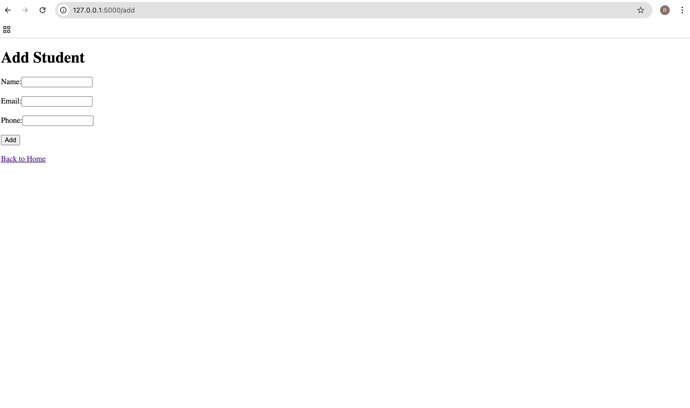
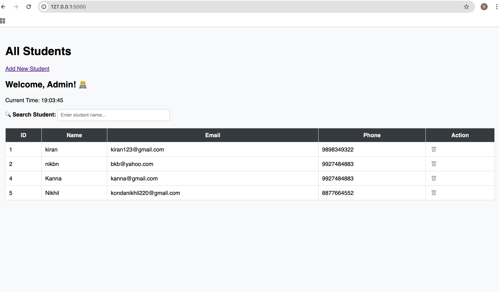

# Student Management System 🎓

A web-based application to manage student records using **Flask + MySQL**.

## 🚀 Features

- Add new students
- View, search, and delete students
- Phone number validation (10 digits)
- Clean UI with icons and styling

## 🛠️ Technologies Used

- Python (Flask)
- MySQL
- HTML5/CSS3

## 📦 How to Run

1. Clone this repository  
2. Set up virtual environment (optional)
3. Install required packages  
4. Create a MySQL DB and update your DB credentials in `app.py`  
5. Run the app:
 python3 app.py
| Column | Type              |
| ------ | ----------------- |
| id     | INT (Primary Key) |
| name   | VARCHAR(100)      |
| phone  | VARCHAR(10)       |
| email  | VARCHAR(100)      |

## 📷 Screenshots

  
  &nbsp;&nbsp;
  

